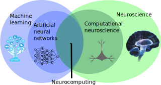
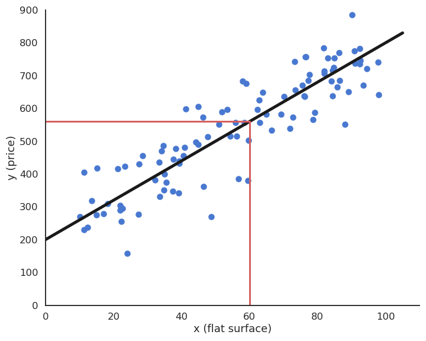

# Introduction

<style>.embed-container { position: relative; padding-bottom: 56.25%; height: 0; overflow: hidden; max-width: 100%; } .embed-container iframe, .embed-container object, .embed-container embed { position: absolute; top: 0; left: 0; width: 100%; height: 100%; }</style><div class='embed-container'><iframe src='https://www.youtube.com/embed/3Ze2EZE2Pko' frameborder='0' allowfullscreen></iframe></div>

Slides: [html](https://www.tu-chemnitz.de/informatik/KI/edu/neurocomputing/lectures/1.1-Introduction.html), [pdf](https://www.tu-chemnitz.de/informatik/KI/edu/neurocomputing/lectures/pdf/1.1-Introduction.pdf)


##  What is neurocomputing?

Let's first discuss the difference between Artificial Intelligence (AI), Machine Learning (ML), Deep Learning (DL) and Neurocomputing. Nowadays, these terms are used almost interchangeably, but there are historical and methodological differences.


```{figure} img/aimldl.png
---
width: 60%
---
Source: <https://data-science-blog.com/blog/2018/05/14/machine-learning-vs-deep-learning-wo-liegt-der-unterschied>
```


The term **Artificial Intelligence** was coined by John McCarthy at the Dartmouth Summer Research Project on Artificial Intelligence in **1956**:

> The study is to proceed on the basis of the conjecture that every aspect of learning or any other feature of intelligence can in principle be so precisely described that a machine can be made to simulate it.

Good old-fashion AI (GOFAI) approaches were purely symbolic (logical systems, knowledge-based systems) or using linear neural networks. They were able to play checkers, prove mathematical theorems, make simple conversations (ELIZA), translate languages...

**Machine learning** (ML) is a branch of AI that focuses on **learning from examples** (data-driven AI). It is sometimes also referred to as big data, data science, operational research, pattern recognition... ML algorithms include:

* Artificial Neural Networks (multi-layer perceptrons)
* Statistical analysis (Bayesian modeling, PCA)
* Clustering algorithms (k-means, GMM, spectral clustering)
* Support vector machines
* Decision trees, random forests

**Deep Learning** is a recent re-branding of artificial neural networks. It focuses on learning high-level representations of the data, using highly non-linear neural networks. Many architectures have been developped, including:

* Deep neural networks (DNN)
* Convolutional neural networks (CNN)
* Recurrent neural networks (RNN)
* Generative models (GAN, VAE)
* Deep reinforcement learning (DQN, A3C, PPO)



**Neurocomputing** is at the intersection between computational neuroscience and artificial neural networks (deep learning). **Computational neuroscience** studies the functioning of the brain (human or animal) through biologically detailed models, either at the functional level (e.g. visual attention, decision-making) or cellular level (individual neurons, synapses, neurotransmitters, etc). The goal of computational neuroscience is 1) to provide theoretical explanations to the experimental observations made by neuroscientists and 2) make predictions that can be verified experimentally. Moreover, understanding how the brain solves real-life problems might allow to design better AI algorithms. If you are interested in computational neuroscience, make sure to visit the courses **Neurokognition** I and II taught by Prof. Dr. Hamker:

<https://www.tu-chemnitz.de/informatik/KI/edu/neurokognition/>

Neurocomputing aims at bringing the mechanisms underlying human cognition into artificial intelligence. The first part of this course focuses on deep learning, while the second will discuss how more biologically realistic neural networks could help designing better AI systems.

## Applications of deep learning

Machine Learning applications are generally divided into three main branches:

* **Supervised learning**: The program is trained on a pre-defined set of training examples and used to make correct predictions when given new data.

* **Unsupervised learning**: The program is given a bunch of data and must find patterns and relationships therein.

* **Reinforcement learning**: The program explores its environment by producing actions and receiving rewards.


```{figure} img/ml-areas.png
---
width: 100%
---
Source: <http://www.isaziconsulting.co.za/machinelearning.html>
```

Deep learning has recently revolutionized these types of machine learning, so let's have a look at some concrete examples for motivation. At the end of the course, if you also perform all exercises, you should be able to reproduce these applications.


### Supervised learning


```{figure} img/supervisedlearning.png
---
width: 50%
---
Source: Andrew Ng, Stanford CS229, <https://see.stanford.edu/materials/aimlcs229/cs229-notes1.pdf>
```

In a supervised learning, we have a **training set** (or training data) consisting of $N$ samples (or examples) from which we want to learn the underlying function or distribution. Each sample consists of an **input** $\mathbf{x}_i$ and an **output** (also called ground truth, desired output or target) $t_i$. 

What we want to learn is **parameterized model** $y_i = f_\theta (\mathbf{x}_i)$ which can predict the correct output for the inputs of the training set. The goal of **learning** (or training) is to find which value of the parameters $\theta$ allows to reduce (*minimize*) the **prediction error**. i.e. the discrepancy between the prediction $y_i = f_\theta (\mathbf{x}_i)$ and the desired output $t_i$. 

Depending on the nature of the outputs $t$, we have two different supervised problems:

* In **regression** tasks, the outputs can take an infinity of values (e.g. real numbers). The following figure shows how examples of flat surfaces (input $x_i$)  and prices (output $t_i$) collected in the neighborhood can be used to predict the price of a new flat. After collecting enough samples, a model is trained to minimize its prediction error. Here, a linear model is used (black line) as we perform **linear regression**, but any other type of function could be used. The parameters of the line (slope and intercept) are adapted so that the line lies close to the data: the predicted price $y_i$ is never far from the ground truth $t_i$. Using that line after learning, we can predict that a 60 square meters flat should be rented around 550 euros/month.



* In **classification** tasks, the outputs are discrete, i.e. take only a finite number of different values (called classes or labels). When there are only two classes, they are called the positive and negative classes and the problem is a **binary classification**. The two classes can represent yes/no binary values, such as when when a test is positive or negative. When there are more than two classes, they can for example represent different objects (car / bike / dog / cat...) that can be recognized on an image. The following figure depicts a binary classifiation problem, where two input features $x_1$ and $x_2$ (temperature and blood pressure) are used to predict the occurence of an illness (yes = ill, no = sane). The linear model is a line that separates the input space into two separate regions: all points above the line are categorized (classified) as ill, all points below as sane, even if they were not in the training data.


In practice, when using neural networks, the distinction between classification and regression is not very important, but it can be relevant for other ML techniques (decision trees only work for classification problems, for example). 

#### Feedforward neural networks

As we will see later, an **artificial neuron** is a mathematical model able to perform **linear** classification or regression using weighted sums of inputs:

$$y = f(\sum_{i=1}^d w_i \, x_i + b)$$

```{figure} img/artificialneuron.svg
---
width: 60%
---
```

By stacking layers of artificial neurons, we obtain a **feedforward neural network** able to solve non-linear classification and regression problems.

```{figure} img/deep.svg
---
width: 60%
---
```

*Fully-connected layers* of neurons can be replaced by *convolutional layers* when dealing with images as inputs, leading to the very successful **convolutional neural networks** (CNN).

```{figure} img/dcn.png
---
width: 90%
---
Source: Albelwi S, Mahmood A. 2017. A Framework for Designing the Architectures of Deep Convolutional Neural Networks. Entropy 19:242. doi:10.3390/e19060242
```

The "only" thing to do is to feed these networks with a lot of training data (inputs and desired outputs) and let them adjust their weights to minimize their prediction error using the backpropagation algorithm {cite}`Rumelhart1986a` (more on that later). Neural networks (including CNNs) are a very old technology, dating back from the 60's, with a resurgence in the 80's thanks to the backpropation algorithm. They had been able to learn small datasets, but their performance was limited by the availability of data and the computing power available at the time. One classical example is the use of a CNN {cite}`LeCun1998` to automatically classify single digits on ZIP postal codes. 


#### Recurrent neural networks

### Unsupervised learning

#### Feature extraction

#### Generative networks

### Reinforcement learning
